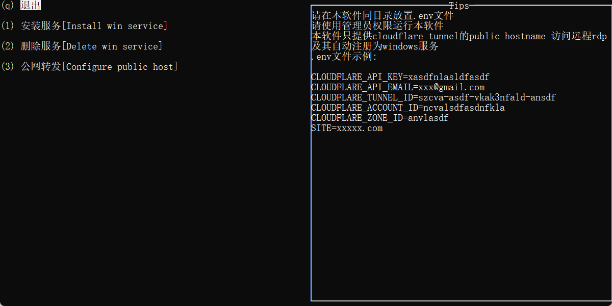
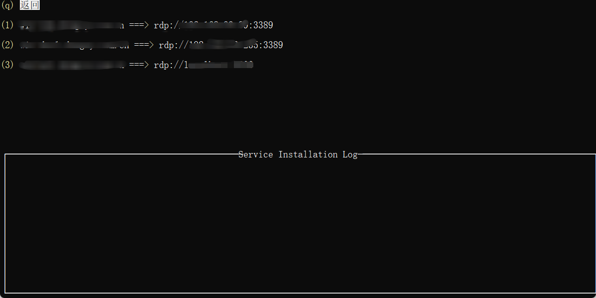
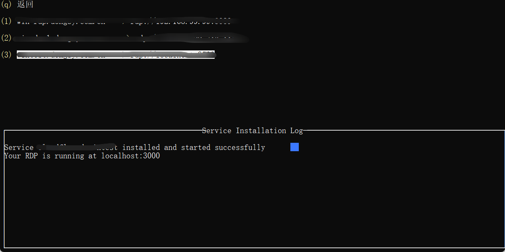
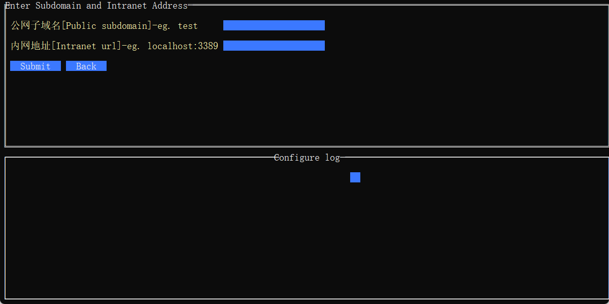
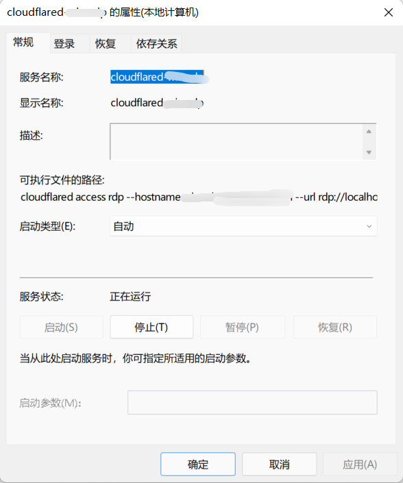

# Cloudflare tunnel rdp management tool

This tool is made for a specific need of automatically registering service on windows.  
According to official document, once you configure a rdp tunnel in public hostname, you need to connect it as user with `cloudflared` client software, this tool helps those who are not familiar with command line and who want to run it backend.  

Have a good trip!

## Usage

You can use it from source:
```sh
git clone https://github.com/DSYZayn/cloudflared_auto
cd ./cloudflared_auto/client
go mod tidy
cd ./cloudflared_auto/cmd
go mod tidy
go build -o 'auto register rdp.exe'
```
Then you get a excutable file `auto register rdp.exe`, run it as an administrator.
And you need to put a `.env` file at the same directory with `auto register rdp.exe`.  
The `.env` file looks like this(example):  
CLOUDFLARE_API_KEY=xasdfasdf  
CLOUDFLARE_API_EMAIL=ixvasdf@gmail.com  
CLOUDFLARE_TUNNEL_ID=vasdkfj-adfnas-fansdlf-asdfn  
CLOUDFLARE_ACCOUNT_ID=abvckafd3fanks320gadf0  
CLOUDFLARE_ZONE_ID=bnvaif943qfdg934455j  
SITE=xxxxx.com  

Or you can download from release.





